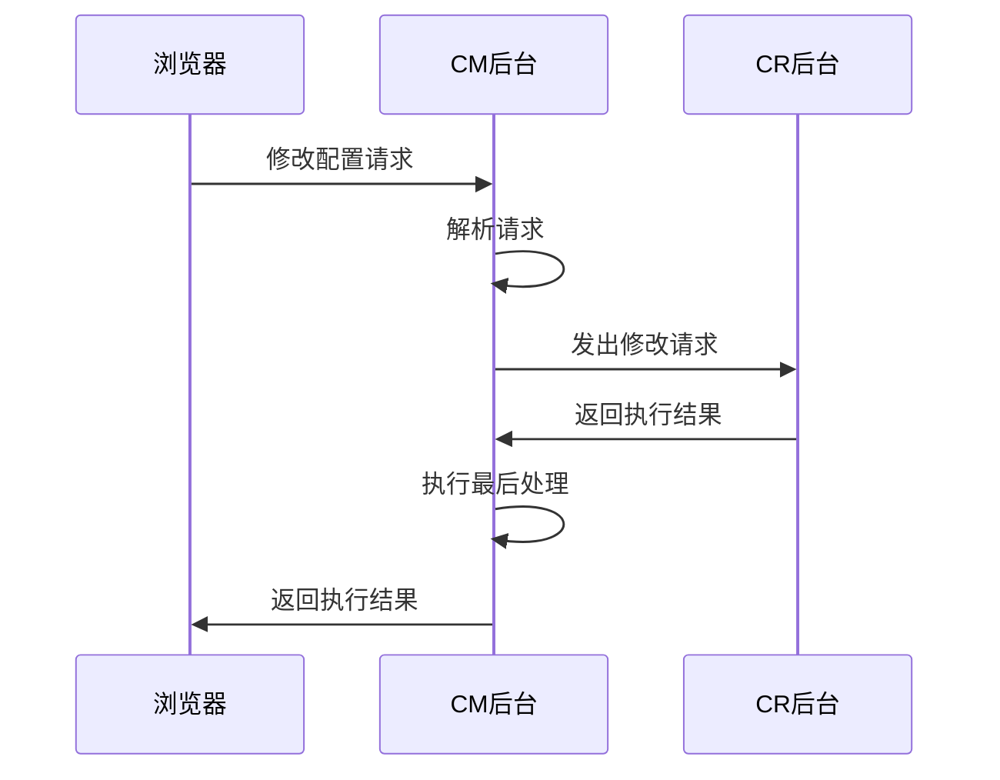
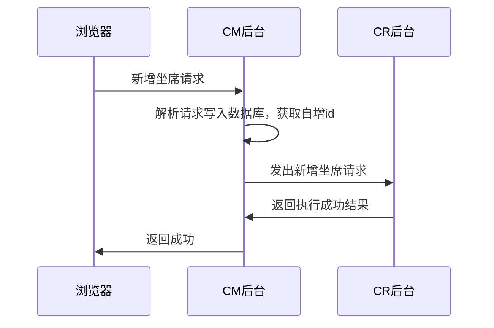
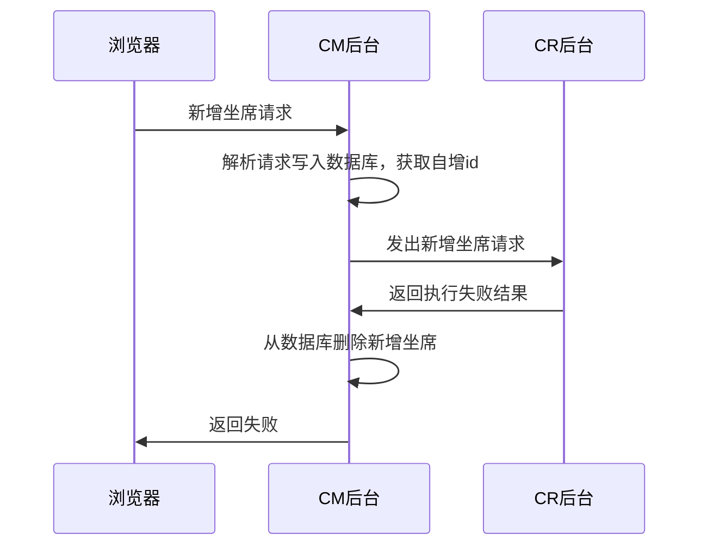
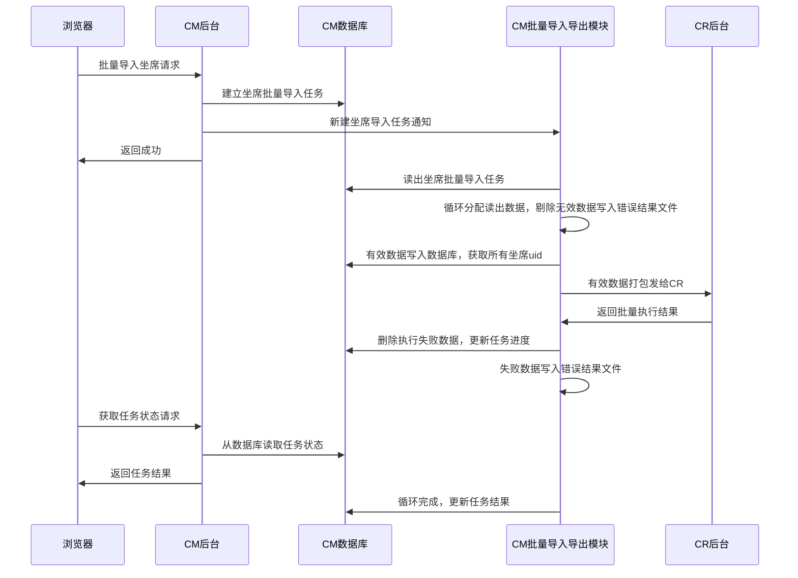

[TOC]

## 	同步接口设计

在CM界面更改呼叫中心配置时，很多情况下都需要同步到CR。因此要求CR对CM提供接口，CM只有在确认CR更改配置成功后，才能最终确认配置已经成功。   

​                              **图 1**  CM <—> CR通用操作同步流程

## 修改配置同步流程

在CM Web界面修改某单项配置或批量修改配置时，均需要等待执行结果并进行相应提示后，才能进行下一步操作。不同的配置操作，不同的配置项，CM后端的具体执行流程可能会有不同。本节针对不同场景总结如下。

### 新增操作

新增操作包括：新增坐席，新增技能组，IVR流程，新增外呼任务，新增话机，新增黑白名单，等等。这些新增操作，因对数据库id的同步要求不同，而有不同的操作流程。

#### CM自增长id需同步到CR数据库

这种操作类型，最典型的就是新增坐席，在CM入库后，得到的自增长id就是坐席的uid，该uid需要同步到CR数据库，因此，其操作流程如下所示：

​                              **图 2**  新增坐席同步成功流程示意图

​                              **图 3**  新增坐席同步失败流程示意图

## 批量导入流程

批量导入数据，如坐席的批量导入，技能组的批量导入，黑白名单的批量导入，批量外呼客户名单的批量导入，等等，都是先生成批量导入任务，然后由后台的批量导入导出任务模块进行处理的。批量导入流程和新增操作流程一样，也需要根据是否同步id确定操作顺序，下面以坐席导入，技能组导入和其它操作为例进行说明。

注：CR-Web提供的批量导入接口，可以参考批量更新/删除接口，允许返回每条数据的执行结果。

###  坐席批量导入流程

